# Практическая работа №2: Основы разметки XML в Android

**Выполнил:**  
Саньков Андрей Александрович  
Группа: ИНС-б-о-24-1  

---

## Цель работы

Изучить основы языка разметки XML для описания пользовательского интерфейса Android-приложений. Научиться использовать менеджеры размещения LinearLayout и GridLayout для создания сложных экранов. Освоить основные атрибуты View и создание простых Drawable-ресурсов.

---

## Ход работы

### Задание 1. Создание проекта и подготовка ресурсов

Создан новый проект с шаблоном Empty Views Activity. Название проекта — Layoutlab. В папке drawable созданы файлы `rectangle.xml` и `circle.xml`:

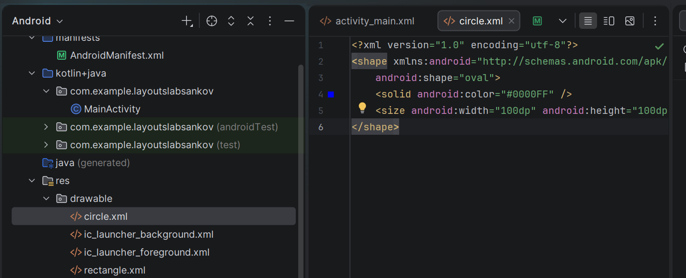

**Рисунок 1** — Файл circle.xml

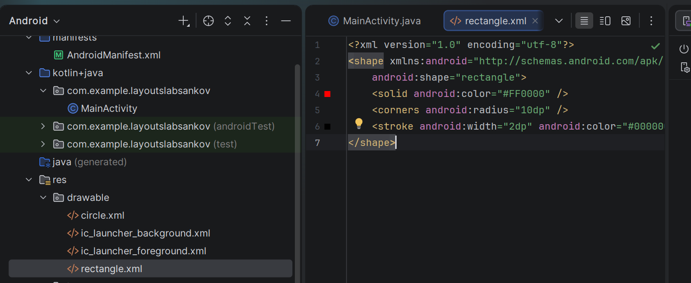

**Рисунок 2** — Файл rectangle.xml

---

### Задание 2. Работа с LinearLayout

Открыт файл `activity_main.xml`. Создан вертикальный LinearLayout с тремя ImageView, отображающими созданные drawable-ресурсы. Запущено приложение для проверки отображения фигур.

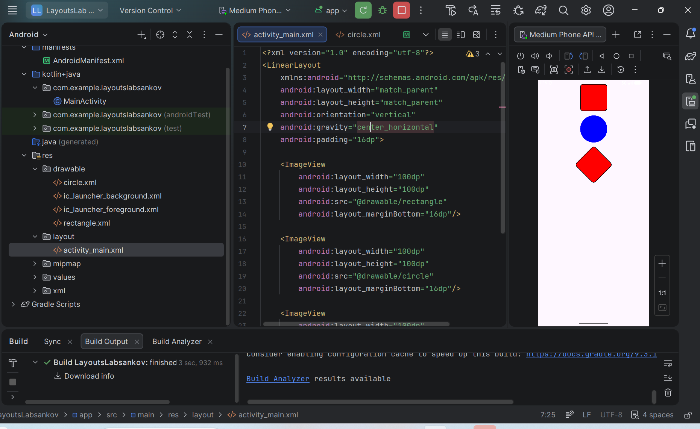

**Рисунок 3** — Отображение фигур из Drawable

---

### Задание 3. Изменение ориентации и выравнивания

**1. Изменение ориентации**

В корневом LinearLayout заменён `android:orientation="vertical"` на `android:orientation="horizontal"`. Фигуры выстроились в одну строку слева направо.

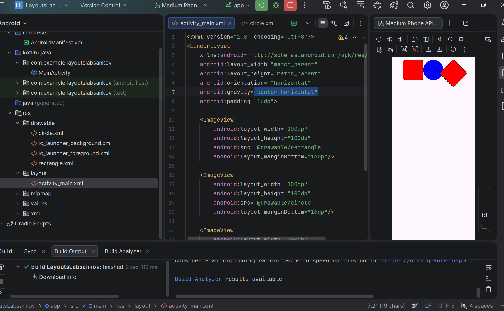

**Рисунок 4** — Изменение ориентации на горизонтальную

**2. Изменение порядка элементов**

Элементы выстроились справа налево. Первый элемент (прямоугольник) оказался справа, последний — слева.

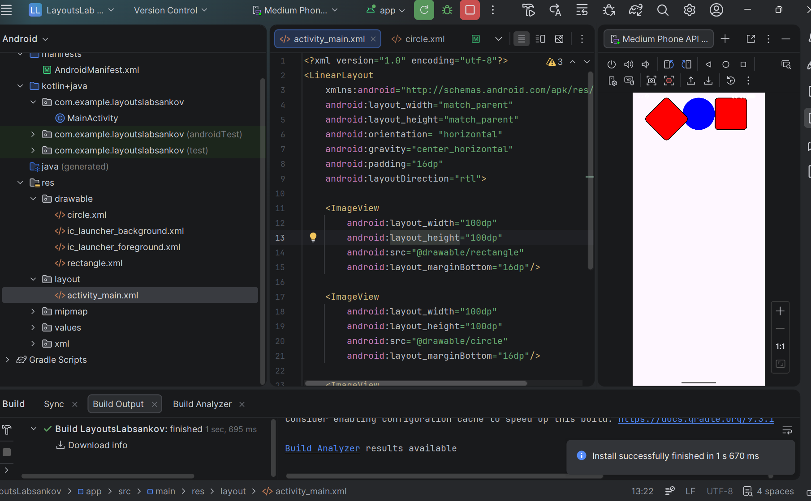

**Рисунок 5** — Изменение порядка элементов

**3. Работа с gravity**

`android:gravity` задаёт выравнивание содержимого внутри контейнера. Изменён параметр gravity у родительского контейнера.

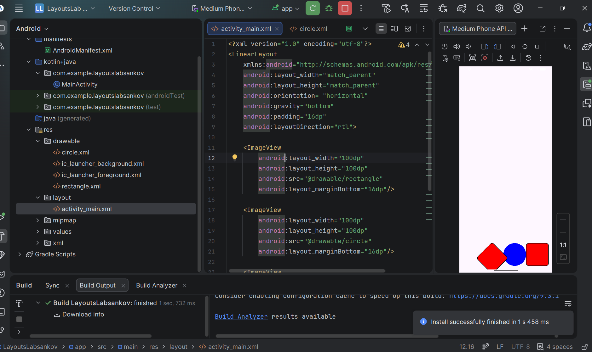

**Рисунок 6** — Изменение gravity у родителя

`android:layout_gravity` задаёт выравнивание конкретного элемента внутри родителя. Добавлен атрибут первому ImageView.

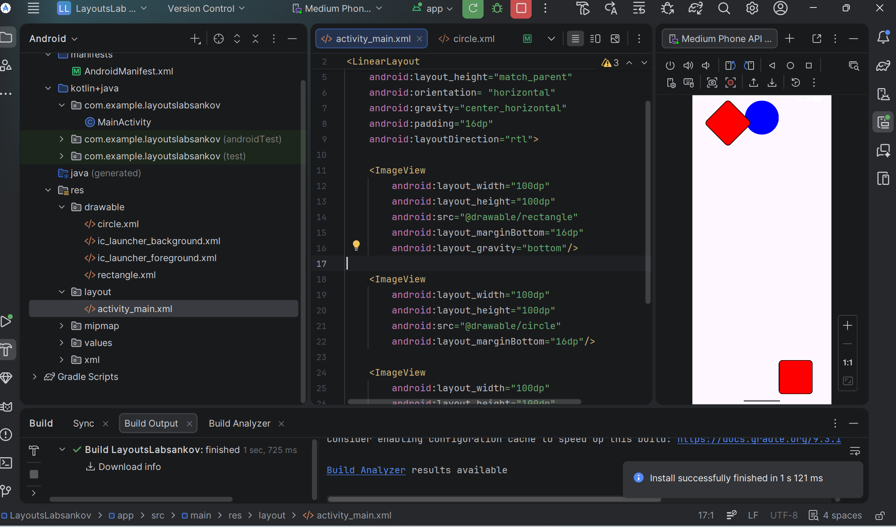

**Рисунок 7** — Изменение gravity у дочернего элемента

---

### Задание 4. Работа с GridLayout

Создан новый XML-файл разметки `activity_grid.xml`. Использован GridLayout для создания таблицы кнопок 3x3.

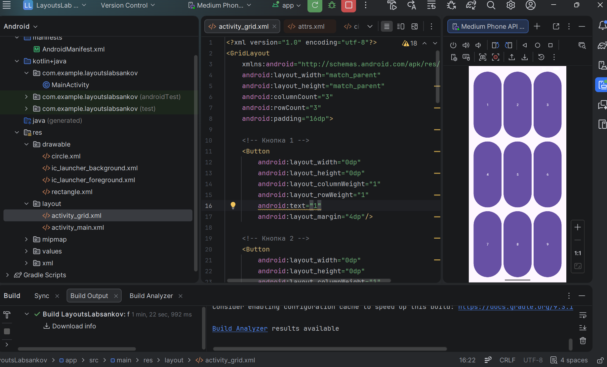

**Рисунок 8** — Таблица кнопок 3x3

---

### Задание 5. Объединение ячеек в GridLayout

Создана разметка, где одна кнопка занимает две ячейки по горизонтали.

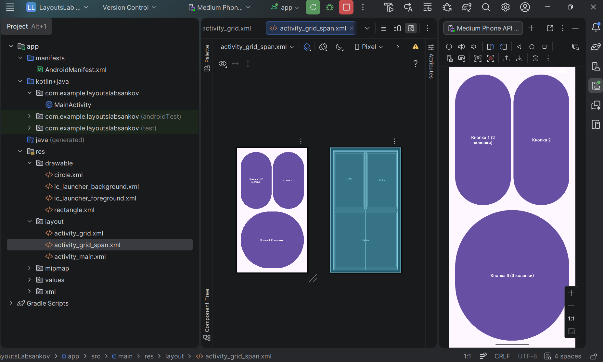

**Рисунок 9** — Объединение ячеек в GridLayout

---

## Задания для самостоятельного выполнения

### 1. Композиция с разноцветными прямоугольниками

Реализовано размещение элементов с использованием вложенных LinearLayout. Внешний контейнер — вертикальный LinearLayout. Внутри два горизонтальных LinearLayout, делящих экран поровну. В каждом — три прямоугольника разных цветов.

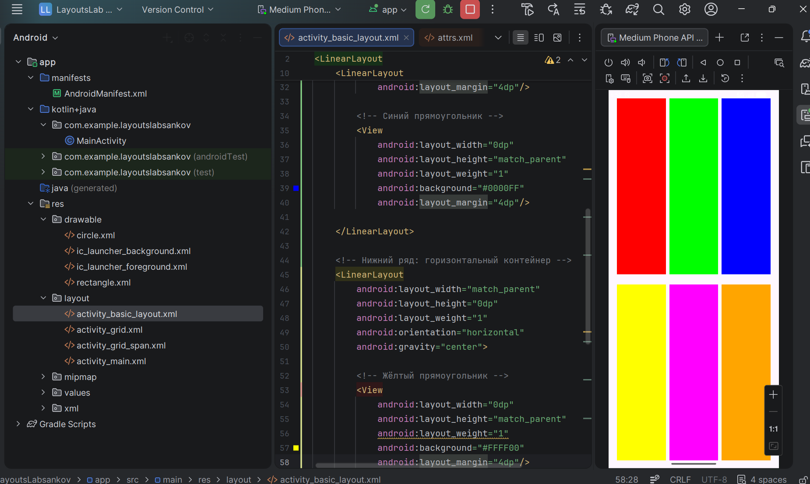

**Рисунок 10** — Композиция с разноцветными прямоугольниками

### 2. Буква "Г" из кнопок

С использованием LinearLayout и/или GridLayout создана композиция в виде буквы "Г".

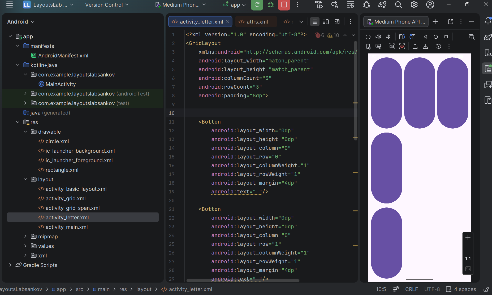

**Рисунок 11** — Буква "Г" из кнопок

---

## Контрольные вопросы

### 1. Что такое XML? Для каких целей он используется в Android-разработке?

XML — язык разметки. В Android используется для описания интерфейса (разметка экранов), ресурсов (строки, цвета, стили) и графических фигур (drawable). Позволяет отделить внешний вид от логики приложения.

### 2. Что такое тег (элемент) в XML? Из каких частей он состоит?

Тег — основная структурная единица. Состоит из открывающего тега, содержимого и закрывающего тега (`<TextView>текст</TextView>`). Если содержимого нет, тег может быть самозакрывающимся (`<View />`). Внутри тега могут быть атрибуты, задающие свойства.

### 3. Какие менеджеры размещения (контейнеры) вы знаете? Кратко опишите каждый.

- **LinearLayout** — располагает дочерние элементы в одну линию (вертикально или горизонтально)
- **GridLayout** — размещает элементы в виде сетки с заданным количеством строк и столбцов
- **RelativeLayout** — элементы позиционируются относительно друг друга или родителя
- **ConstraintLayout** — гибкий контейнер с привязками, рекомендуется для сложных интерфейсов

### 4. В чём разница между LinearLayout и GridLayout? В каких случаях какой контейнер удобнее использовать?

LinearLayout выстраивает элементы последовательно (строкой или столбцом). Удобен для простых списков. GridLayout распределяет элементы по ячейкам таблицы. Подходит для равномерных сеток (клавиатура, калькулятор).

### 5. Что такое match_parent и wrap_content? Приведите примеры использования.

- `match_parent` — элемент занимает всю доступную ширину/высоту родителя
- `wrap_content` — элемент подстраивается под размер содержимого

Пример: `<Button android:layout_width="match_parent" android:layout_height="wrap_content" />` — кнопка растянется по ширине, высота определится по тексту.

### 6. В чём разница между android:gravity и android:layout_gravity?

- `android:gravity` — выравнивание содержимого внутри самого элемента (текст внутри кнопки)
- `android:layout_gravity` — выравнивание элемента относительно родительского контейнера (кнопка прижимается к краю)

### 7. Какие единицы измерения используются в Android? Для чего предназначены dp и sp?

- **px** — пиксели
- **dp** — плотностно-независимые пиксели, не зависят от плотности экрана
- **sp** — масштабируемые пиксели для размера текста, учитывают настройки шрифта пользователя

### 8. Как создать простую фигуру (прямоугольник, круг) с помощью XML-ресурса в папке drawable?

В папке `res/drawable` создать XML-файл. Корневой тег `<shape>`. Атрибут `android:shape="rectangle"` или `"oval"`. Внутри задать:
- цвет: `<solid android:color="#RRGGBB" />`
- размер: `<size android:width="..." android:height="..." />`
- скругление: `<corners android:radius="..." />`
- обводку: `<stroke android:width="..." android:color="..." />`

Затем использовать ресурс через `@drawable/имя_файла`.

---

## Вывод

В ходе выполнения практической работы были изучены основы XML-разметки в Android. Освоены основные менеджеры размещения (LinearLayout и GridLayout), их атрибуты и принципы работы. На практике рассмотрены создание Drawable-ресурсов, работа с gravity и layout_gravity, объединение ячеек в GridLayout. Полученные навыки необходимы для создания сложных пользовательских интерфейсов в Android-приложениях.
